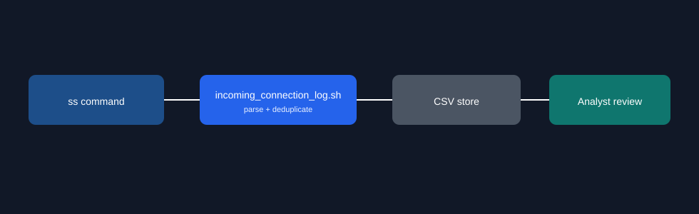

# incoming-connection-logger

Bash script for continuously capturing inbound network connection metadata and storing deduplicated records for operational security visibility.

## Problem
Teams without lightweight network telemetry often miss early signs of unauthorized inbound activity. Native tools exist, but repeated manual inspection is slow and inconsistent.

## Security Context
- Creates a timestamped record of inbound connections for triage and investigations.
- Captures source/destination details and process metadata for faster incident response.
- Reduces blind spots in host-level network monitoring.

## Architecture/Flow


## Setup
```bash
git clone git@github.com:jaskaranhundal/incoming-connection-logger.git
cd incoming-connection-logger
chmod +x incoming_connection_log.sh
./incoming_connection_log.sh -v
```

```
-o FILE     CSV output path   (default: incoming_connection_log.csv)
-i SECONDS  Poll interval     (default: 10)
-v          Verbose progress to stderr
-1          Single scan, then exit
```

Run under cron with `-1`; state is rebuilt from the CSV on start, so a peer is
logged once regardless of how often the script is invoked:

```cron
* * * * * /opt/incoming-connection-logger/incoming_connection_log.sh -1 -o /var/log/inbound.csv
```

Requirements:
- Linux environment (`ss` from iproute2)
- Permissions to inspect socket/process details (`-p` needs root for other users' processes)

## Example Output
```text
timestamp_utc,source_ip,source_port,destination_ip,destination_port,process
"2026-02-20T09:00:01Z","10.1.0.45","54321","10.1.0.10","22","users:((""sshd"",pid=1290,fd=3))"
"2026-02-20T09:00:11Z","2001:db8::99","50012","2001:db8::1","443","users:((""nginx"",pid=842,fd=7))"
```

Every field is quoted because `ss` reports the process column as
`users:(("nginx",pid=842,fd=7))` — the embedded commas corrupt an unquoted CSV.

## Limitations
- Host-level only (not a network tap or packet capture).
- Polling, not event-driven: a connection opening and closing inside one interval is missed.
- Deduplication key is `source_ip:source_port:destination_port`, so a peer reconnecting
  from a new ephemeral port is recorded as a new row (intentional — it is a new session).
- No built-in SIEM export pipeline yet.

## Roadmap
- Add JSON output mode for log forwarding.
- Add allowlist/denylist filters.
- Add systemd service unit and retention policy support.
- Add severity tagging for suspicious source patterns.
